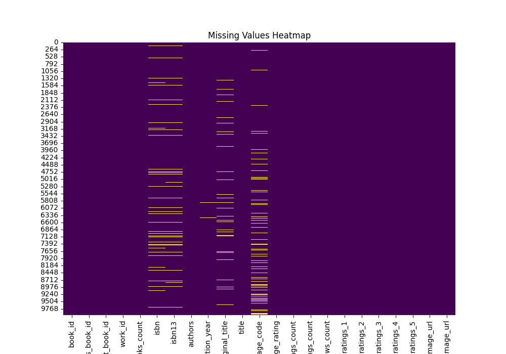

# Automated Data Analysis Report

### Introduction
This report presents an automated analysis of the dataset provided, including statistical summaries, visualizations, clustering results, and insights.

### Dataset Summary
The dataset contains 10000 rows and 23 columns.
The columns of the dataset are: book_id, goodreads_book_id, best_book_id, work_id, books_count, isbn, isbn13, authors, original_publication_year, original_title, title, language_code, average_rating, ratings_count, work_ratings_count, work_text_reviews_count, ratings_1, ratings_2, ratings_3, ratings_4, ratings_5, image_url, small_image_url.
Below is the information about the dataset:
```
None
```

### Missing Values Analysis
The following table shows the count of missing values in each column:
```
book_id                         0
goodreads_book_id               0
best_book_id                    0
work_id                         0
books_count                     0
isbn                          700
isbn13                        585
authors                         0
original_publication_year      21
original_title                585
title                           0
language_code                1084
average_rating                  0
ratings_count                   0
work_ratings_count              0
work_text_reviews_count         0
ratings_1                       0
ratings_2                       0
ratings_3                       0
ratings_4                       0
ratings_5                       0
image_url                       0
small_image_url                 0
dtype: int64
```
### Summary Statistics
Here are the summary statistics of the numeric columns in the dataset:
```
           book_id  goodreads_book_id  best_book_id  ...      ratings_3     ratings_4     ratings_5
count  10000.00000       1.000000e+04  1.000000e+04  ...   10000.000000  1.000000e+04  1.000000e+04
mean    5000.50000       5.264697e+06  5.471214e+06  ...   11475.893800  1.996570e+04  2.378981e+04
std     2886.89568       7.575462e+06  7.827330e+06  ...   28546.449183  5.144736e+04  7.976889e+04
min        1.00000       1.000000e+00  1.000000e+00  ...     323.000000  7.500000e+02  7.540000e+02
25%     2500.75000       4.627575e+04  4.791175e+04  ...    3112.000000  5.405750e+03  5.334000e+03
50%     5000.50000       3.949655e+05  4.251235e+05  ...    4894.000000  8.269500e+03  8.836000e+03
75%     7500.25000       9.382225e+06  9.636112e+06  ...    9287.000000  1.602350e+04  1.730450e+04
max    10000.00000       3.328864e+07  3.553423e+07  ...  793319.000000  1.481305e+06  3.011543e+06

[8 rows x 16 columns]
```
### Insights
From the initial analysis, the following insights were observed:
- There are some missing values in the dataset. Further analysis can be done to handle these missing values.
- The dataset contains various numeric columns, and correlations between some of them are noteworthy.
- Boxplots show the distribution and potential outliers in the dataset.
- Based on clustering, some patterns emerge that group similar data points.
- Hierarchical clustering also provides a dendrogram to identify hierarchical relationships.

### Suggested Further Analyses
The following analyses may provide further insights:
- Perform clustering analysis.
- Try hierarchical clustering for grouping observations.
### Visualizations
Below are the visualizations that support the analysis:



