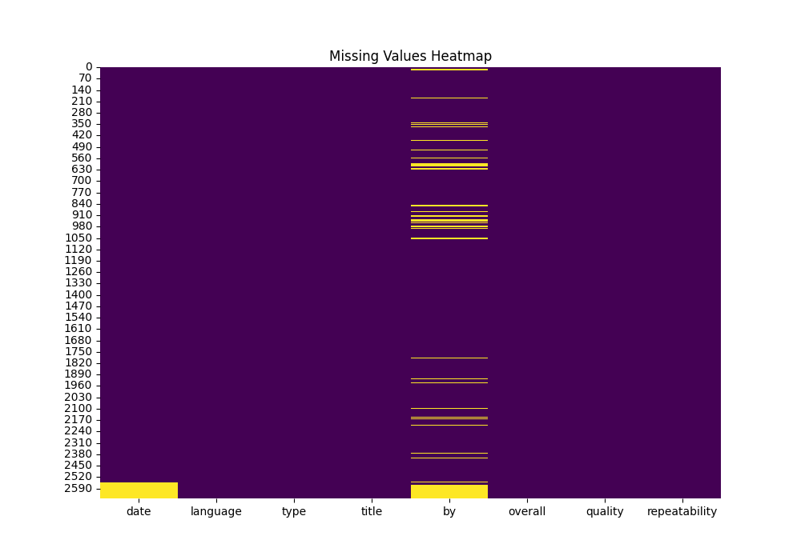
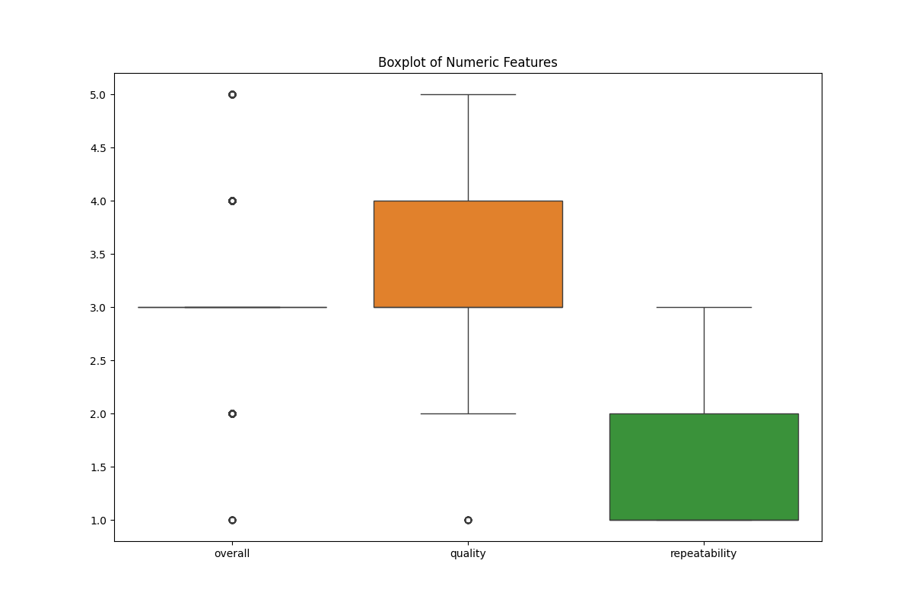
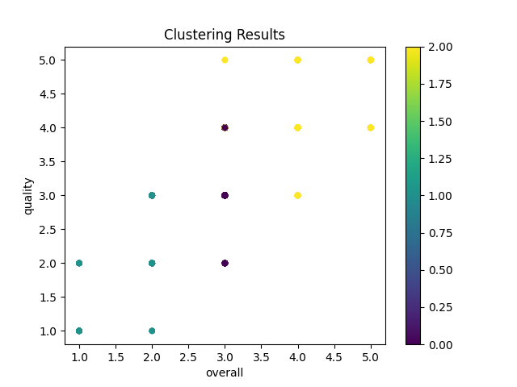

# Automated Data Analysis Report

### Introduction
This report presents an automated analysis of the dataset provided, including statistical summaries, visualizations, clustering results, and insights.

### Dataset Summary
The dataset contains 2652 rows and 8 columns.
The columns of the dataset are: date, language, type, title, by, overall, quality, repeatability.
Below is the information about the dataset:
```
None
```

### Missing Values Analysis
The following table shows the count of missing values in each column:
```
date              99
language           0
type               0
title              0
by               262
overall            0
quality            0
repeatability      0
dtype: int64
```
### Summary Statistics
Here are the summary statistics of the numeric columns in the dataset:
```
           overall      quality  repeatability
count  2652.000000  2652.000000    2652.000000
mean      3.047511     3.209276       1.494721
std       0.762180     0.796743       0.598289
min       1.000000     1.000000       1.000000
25%       3.000000     3.000000       1.000000
50%       3.000000     3.000000       1.000000
75%       3.000000     4.000000       2.000000
max       5.000000     5.000000       3.000000
```
### Insights
From the initial analysis, the following insights were observed:
- There are some missing values in the dataset. Further analysis can be done to handle these missing values.
- The dataset contains various numeric columns, and correlations between some of them are noteworthy.
- Boxplots show the distribution and potential outliers in the dataset.
- Based on clustering, some patterns emerge that group similar data points.
- Hierarchical clustering also provides a dendrogram to identify hierarchical relationships.

### Suggested Further Analyses
The following analyses may provide further insights:
- Perform clustering analysis.
- Try hierarchical clustering for grouping observations.
- Consider time series analysis for trends and forecasting.
### Visualizations
Below are the visualizations that support the analysis:





